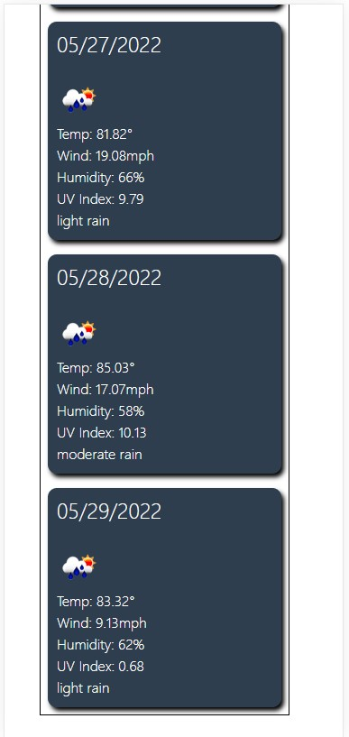
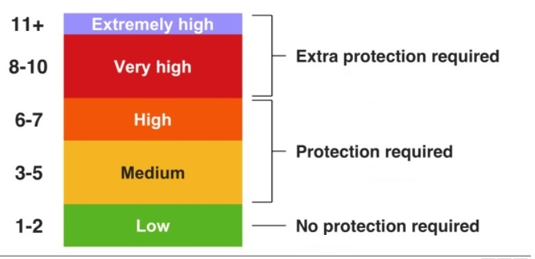

# Challenge Week 6 - Weather App

## User Story
AS A traveler  
I WANT to see the weather outlook for multiple cities  
SO THAT I can plan a trip accordingly  

## Acceptance Criteria
GIVEN a weather dashboard with form inputs  
WHEN I search for a city  
THEN I am presented with current and future conditions for that city and that city is added to the search history  
WHEN I view current weather conditions for that city  
THEN I am presented with the city name, the date, an icon representation of weather conditions, the temperature, the humidity, the wind speed, and the UV index  
WHEN I view the UV index  
THEN I am presented with a color that indicates whether the conditions are favorable, moderate, or severe  
WHEN I view future weather conditions for that city  
THEN I am presented with a 5-day forecast that displays the date, an icon representation of weather conditions, the temperature, the wind speed, and the humidity  
WHEN I click on a city in the search history  
THEN I am again presented with current and future conditions for that city  

## Screenshots Desktop
Desktop example  

## Screenshots Mobile
Mobile example - page 1  

Mobile example - page 2  

Mobile example - page 3  

## Live Site
[Live Weather Dashboard](https://joebarbone.github.io/c-w6-weather-app/)

## Summary/Languages

This exercise was completed using HTML/CSS/Bootstrap and JavaScript. The original assignement called for only having a weather icon but during the focus group it was discovered that some people couldn't always tell what the icons meant, so the development team resolved the issue by also putting the verbal "conditions" at the bottom. This does not disctract from the original request and provides a text base description of the weather conditions that everyone can understand. 

Weather Dashboard also keeps a history of each city you check. It will only add a city to the history if the city doesn't already exist. Clicking on a city button in the history section will take you to the conditions for that city. You also have the option to clear the history.

UV Index color was determined using the following scale.

## Acknowledgements

Concept provided by UCF/2U Educational Services.  
Programming performed by Joseph Barbone.
